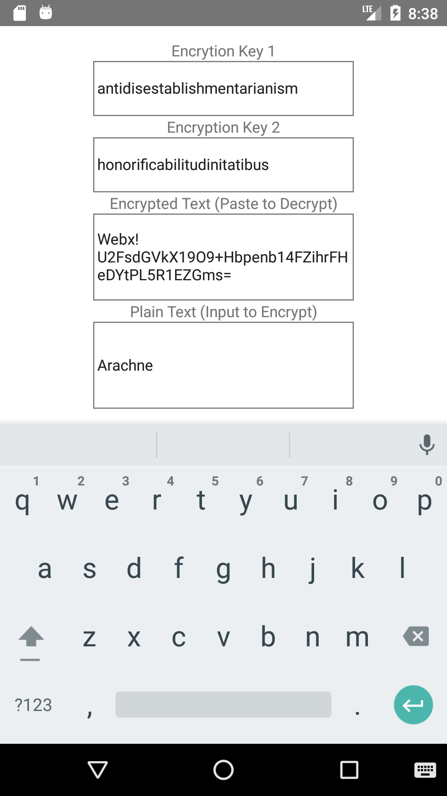
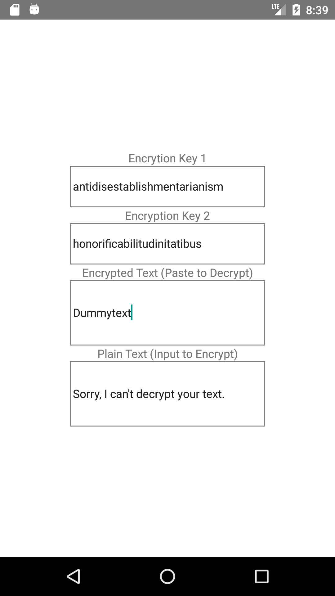
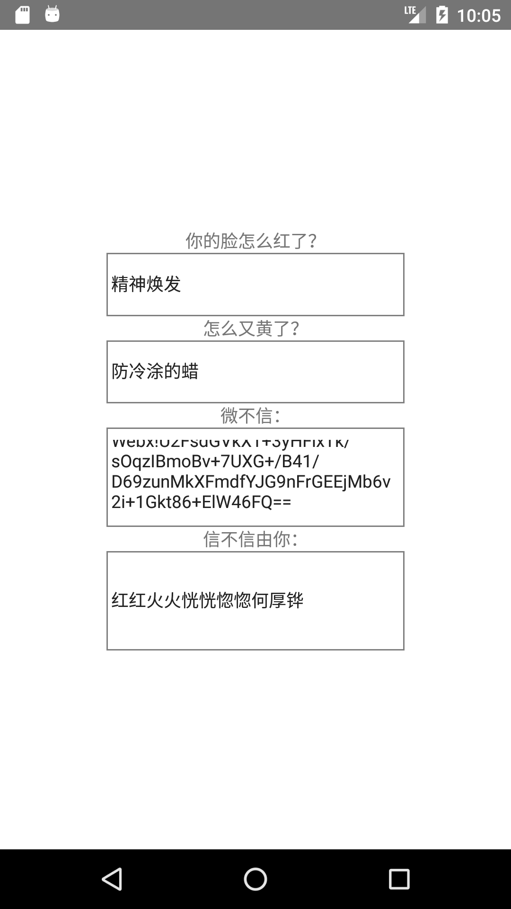

# Webx

An encryption tool for simple message transmission.

# Running Webx

```
# Install Debug Dependencies
npm install react-native-cli -g
npm install

# Build Android JS Bundle (required after each modification)
react-native bundle --platform android --dev false --entry-file index.js --bundle-output android\app\src\main\assets\index.android.bundle --assets-dest android\app\src\main\res

# Run Android
react-native run-android

# Run iOS
react-native run-ios
```

# Build APK

See [Generating Signed APK](https://facebook.github.io/react-native/docs/signed-apk-android.html)

# Screenshots

